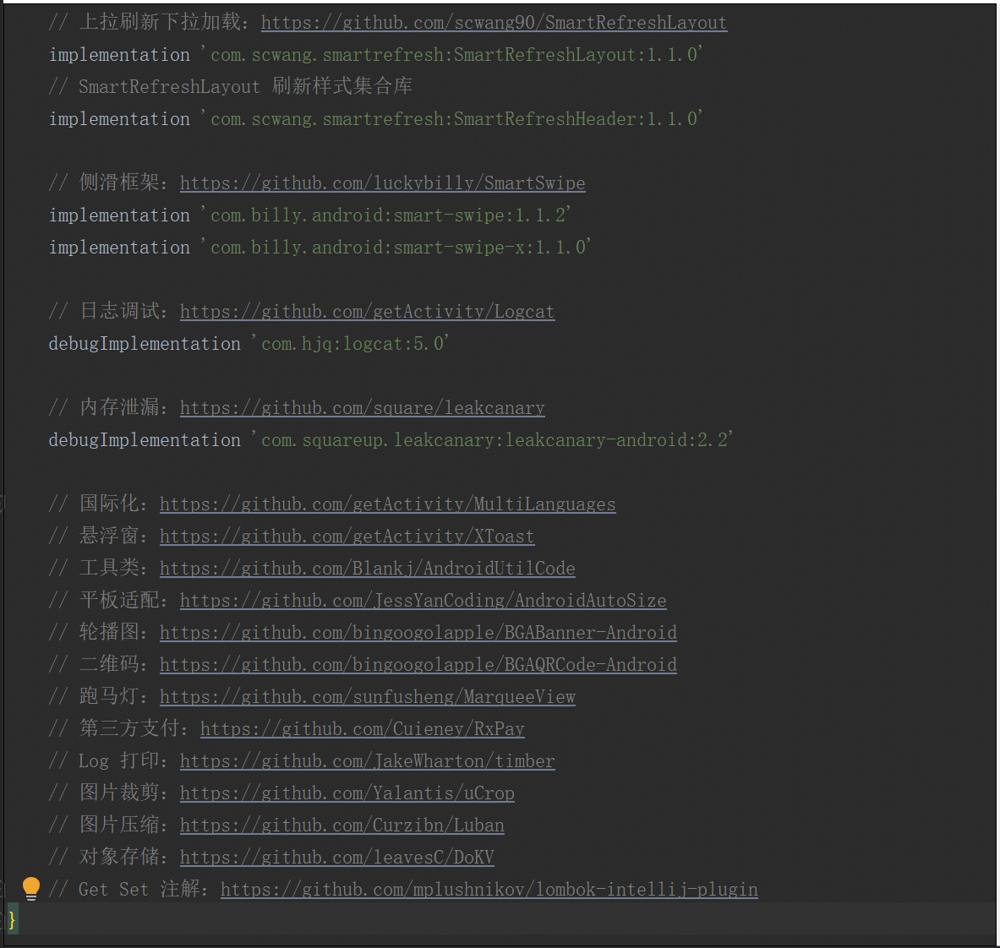

[博客地址：Studio 精品插件推荐](https://www.jianshu.com/p/54bfd9e4d24c)

#### Java 代码约束插件

* 插件名称：[Alibaba Java Coding Guidelines](https://plugins.jetbrains.com/plugin/10046-alibaba-java-coding-guidelines)

* 插件简介：这是阿里巴巴开发的一款代码约束插件，当我们的代码不符合规范时，会有相应的警告提示，能够帮助我们在开发中提升代码质量。

* 插件文档：安装成功后重启，插件在发现预览 Java 类中发现不规范的地方会有黄色的警告。


#### Drawable 预览插件

* 插件名称：[Android Drawable Preview](https://plugins.jetbrains.com/plugin/10730-android-drawable-preview)

* 插件简介：这是一款在 Studio 上预览图片资源缩略图的插件，能帮我们快速定位欲查找图片的位置，除此之外还支持显示 xml 资源的缩略图。

* 插件文档：安装成功后重启，即可通过 drawable 或者 mipmap 文件夹进行预览图片。


#### Json 转 Java Bean 插件

* 插件名称：[GsonFormat](https://plugins.jetbrains.com/plugin/7654-gsonformat)

* 插件简介：这是一款能够帮助我们将后台返回的 Json 转换成 Java Bean 类中的字段的插件，可极大提升我们的调试接口的效率及准确度。

* 插件文档：在 Bean 类中右击，选择 `Generate` -> `GsonFormat`，输入后台返回的 Json 数据即可转换成 Java Bean。


#### Json 转 Kotlin Bean 插件

* 插件名称：[JSON To Kotlin Class](https://plugins.jetbrains.com/plugin/9960-json-to-kotlin-class-jsontokotlinclass-)

* 插件简介：这是一款能够帮助我们将后台返回的 Json 转换成 Kotlin Bean 类中的字段的插件，可极大提升我们的调试接口的效率及准确度。

* 插件文档：在 Bean 类中右击，选择 `Generate` -> `Convert Json Into Kotlin Class`，输入后台返回的 Json 数据即可转换成 Kotlin Bean。


#### Parcelable 序列化插件

* 插件名称：[Android Parcelable code generator](https://plugins.jetbrains.com/plugin/7332-android-parcelable-code-generator)

* 插件简介：在日常开发中，我们不可避免要对 Bean 类序列化，而序列化方式有两种，一种是 Serializable，实现方式比较简单但是比较耗性能，另外一种是 Parcelable，相比 Serializable 性能更好，但是实现过程比较麻烦，这时这款插件发挥的作用就恰到好处了，它能够帮我们节省整个繁琐的实现过程。

* 插件文档：在 Bean 类中右击，选择 `Generate` -> `Parcelable`，然后选择需要序列化的字段即可。


#### 英文翻译插件

* 插件名称：[ECTranslation](https://plugins.jetbrains.com/plugin/8469-ectranslation)

* 插件简介：我们在 Review 代码或者注释时，偶尔会对某个单词或者句子感到陌生，多数人会选择到第三方软件或者网站去翻译，但是这一来二去也是相对比较麻烦，这个时候你只要换上这款插件，即可在 Studio 中直接翻译，这样可以大大提高我们对代码的专注度。

* 插件文档：选中欲翻译的英文单词或者句子，鼠标右击选择 Translate（默认为第一个选项）



#### Json 格式化插件

* 插件名称：[JsonViewer](https://plugins.jetbrains.com/plugin/9679-json-viewer)

* 插件简介：当日志打印的 Json 没有经过格式化的时候，我们 Review 起来会非常困难，这时可以利用这款插件对 Json 文本进行格式化，相比我们去网页格式化，这种方式极大提高了我们的效率

* 插件文档：不需要任何快捷键，只需要找到 Studio 窗口最右边，即可找到 `Json Viewer` 选项，点击即可


#### 快速安装方式

* 下载好插件，选择 `Settings` -> `Plugins`  -> `Install Plugin from Disk` 进行安装


#### 作者的其他开源项目

* 架构工程：[AndroidProject](https://github.com/getActivity/AndroidProject)

* 网络框架：[EasyHttp](https://github.com/getActivity/EasyHttp)

* 日志框架：[Logcat](https://github.com/getActivity/Logcat)

* 权限框架：[XXPermissions](https://github.com/getActivity/XXPermissions)

* 吐司框架：[ToastUtils](https://github.com/getActivity/ToastUtils)

* 标题栏框架：[TitleBar](https://github.com/getActivity/TitleBar)

* 国际化框架：[MultiLanguages](https://github.com/getActivity/MultiLanguages)

* 悬浮窗框架：[XToast](https://github.com/getActivity/XToast)

#### Android技术讨论Q群：78797078

#### 如果您觉得我的开源库帮你节省了大量的开发时间，请扫描下方的二维码随意打赏，要是能打赏个 10.24 :monkey_face:就太:thumbsup:了。您的支持将鼓励我继续创作:octocat:

 

#### [点击查看捐赠列表](https://github.com/getActivity/Donate)

## License

```text
Copyright 2020 Huang JinQun

Licensed under the Apache License, Version 2.0 (the "License");
you may not use this file except in compliance with the License.
You may obtain a copy of the License at

   http://www.apache.org/licenses/LICENSE-2.0

Unless required by applicable law or agreed to in writing, software
distributed under the License is distributed on an "AS IS" BASIS,
WITHOUT WARRANTIES OR CONDITIONS OF ANY KIND, either express or implied.
See the License for the specific language governing permissions and
limitations under the License.
```