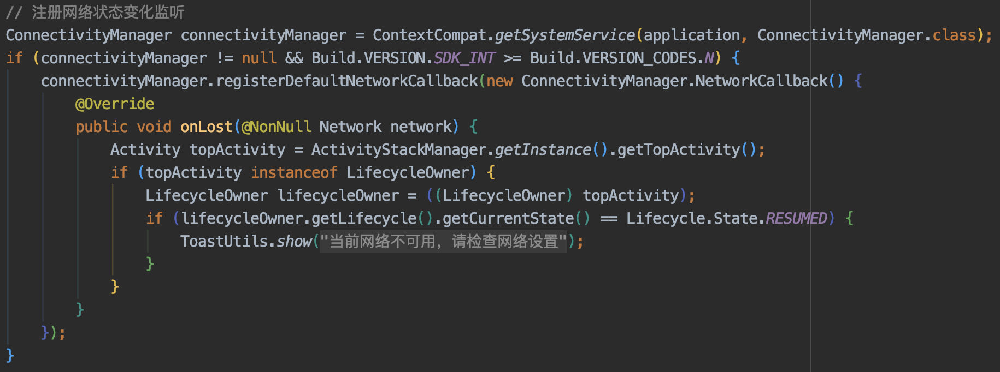
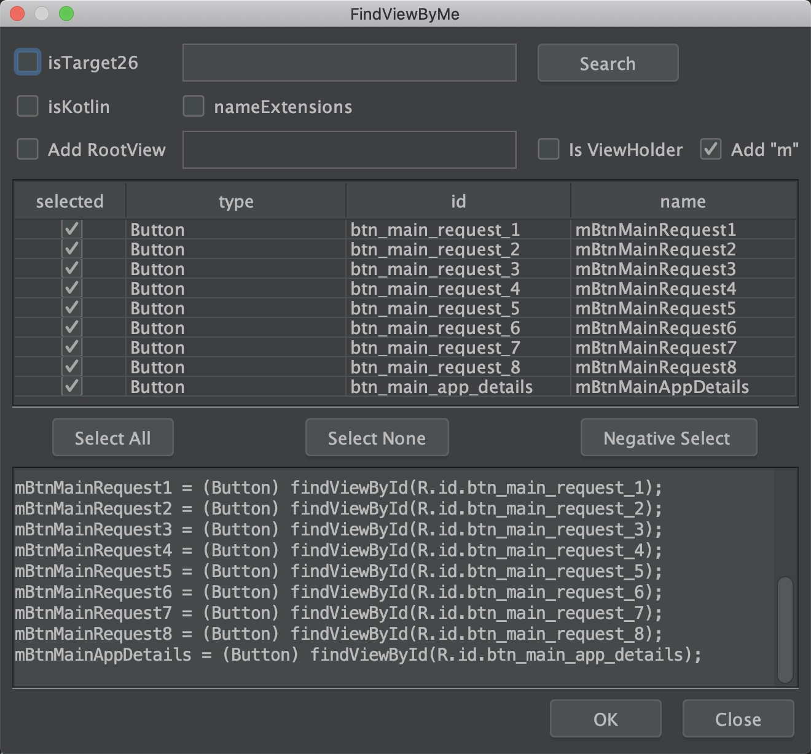

# Studio 精品插件

* 码云地址：[Gitee](https://gitee.com/getActivity/StudioPlugins)

* 博客地址：[Studio 精品插件推荐](https://www.jianshu.com/p/54bfd9e4d24c)

#### 使用需知

* 所有插件在 Android Studio 4.1 上测试均没有问题，推荐使用此版本

* Android Studio 4.1 正式版下载：[Windows 版本](https://r3---sn-bvn0o-tpil.gvt1.com/edgedl/android/studio/ide-zips/4.1.1.0/android-studio-ide-201.6953283-windows.zip?cms_redirect=yes&mh=Sc&mip=113.67.225.24&mm=28&mn=sn-bvn0o-tpil&ms=nvh&mt=1609828574&mv=m&mvi=3&pl=18&shardbypass=yes)，[MacOs 版本](https://r1---sn-bvn0o-tpil.gvt1.com/edgedl/android/studio/install/4.1.1.0/android-studio-ide-201.6953283-mac.dmg?cms_redirect=yes&mh=V0&mip=113.67.225.24&mm=28&mn=sn-bvn0o-tpil&ms=nvh&mt=1609827855&mv=m&mvi=1&pl=18&shardbypass=yes)

* 下载好插件，选择 `Settings` -> `Plugins`  -> `Install Plugin from Disk` 进行安装


* 小技巧：如果出现安装不了的情况，并且 Studio 不是 4.1 版本，可以直接复制插件的名称然后在 Studio 插件在线搜索并下载，Studio 会自动帮你匹配最佳的插件版本。

#### 更新日志

* 2020 年 1 月 14 日：所有插件均适配 Android Studio 4.1 版本，新增 IDEA 中文包插件和 findViewById 生成插件

* 2020 年 8 月 9 日：更换英文翻译插件，新增彩虹括号插件、代码预览小窗口插件

* 2020 年 5 月 18 日：更新远程仓库依赖插件的版本及插件介绍

* 2020 年 5 月 16 日：新增远程仓库依赖插件、更新 Java 代码约束插件版本

* 2020 年 3 月 30 日：新增 Json 转 Kotlin Bean 插件和 Json 格式化插件

* 2020 年 3 月 21 日：新增一个英文翻译插件

* 2020 年 3 月 14 日：第一次提交，本提交了四款插件：Java 代码约束插件、Drawable 预览插件、Json 转 Bean 插件、Parcelable 序列化插件

#### Java 代码约束插件

* 插件名称：[Alibaba Java Coding Guidelines](https://plugins.jetbrains.com/plugin/10046-alibaba-java-coding-guidelines)

* 插件简介：这是阿里巴巴开发的一款代码约束插件，当我们的代码不符合规范时，会有相应的警告提示，能够帮助我们在开发中提升代码质量。

* 插件文档：安装成功后重启，插件在发现预览 Java 类中发现不规范的地方会有黄色的警告。


#### Drawable 预览插件

* 插件名称：[Android Drawable Preview](https://plugins.jetbrains.com/plugin/10730-android-drawable-preview)

* 插件简介：这是一款在 Studio 上预览图片资源缩略图的插件，能帮我们快速定位欲查找图片的位置，除此之外还支持显示 xml 资源的缩略图。

* 插件文档：安装成功后重启，即可通过 drawable 或者 mipmap 文件夹进行预览图片。


#### Json 转 Java Bean 插件

* 插件名称：[GsonFormatPlus](https://plugins.jetbrains.com/plugin/14949-gsonformatplus)

* 插件简介：这是一款能够帮助我们将后台返回的 Json 转换成 Java Bean 类中的字段的插件，可极大提升我们的调试接口的效率及准确度。

* 插件文档：在 Bean 类中右击，选择 `Generate` -> `GsonFormatPlus`，输入后台返回的 Json 数据即可转换成 Java Bean。


#### Json 转 Kotlin Bean 插件

* 插件名称：[JSON To Kotlin Class](https://plugins.jetbrains.com/plugin/9960-json-to-kotlin-class-jsontokotlinclass-)

* 插件简介：这是一款能够帮助我们将后台返回的 Json 转换成 Kotlin Bean 类中的字段的插件，可极大提升我们的调试接口的效率及准确度。

* 插件文档：在 Bean 类中右击，选择 `Generate` -> `Convert Json Into Kotlin Class`，输入后台返回的 Json 数据即可转换成 Kotlin Bean。


#### Parcelable 序列化插件

* 插件名称：[Android Parcelable code generator](https://plugins.jetbrains.com/plugin/7332-android-parcelable-code-generator)

* 插件简介：在日常开发中，我们不可避免要对 Bean 类序列化，而序列化方式有两种，一种是 Serializable，实现方式比较简单但是比较耗性能，另外一种是 Parcelable，相比 Serializable 性能更好，但是实现过程比较麻烦，这时这款插件发挥的作用就恰到好处了，它能够帮我们节省整个繁琐的实现过程。

* 插件文档：在 Bean 类中右击，选择 `Generate` -> `Parcelable`，然后选择需要序列化的字段即可。


#### Json 格式化插件

* 插件名称：[JsonViewer](https://plugins.jetbrains.com/plugin/9679-json-viewer)

* 插件简介：当日志打印的 Json 没有经过格式化的时候，我们 Review 起来会非常困难，这时可以利用这款插件对 Json 文本进行格式化，相比我们去网页格式化，这种方式极大提高了我们的效率

* 插件文档：不需要任何快捷键，只需要找到 Studio 窗口最右边，即可找到 `Json Viewer` 选项，点击即可


#### 远程仓库依赖插件

* 插件名称：[GoogleLibraryVersionQuerier](https://github.com/wuyr/GoogleLibraryVersionQuerier)

* 插件简介：这是一款能帮助你快速添加远程依赖库和查询历史版本的插件

* 插件文档：在 Gradle 中输入想要添加的仓库名称即可联想到对应的依赖库，鼠标右击选择 `Query Available Versions` 可查询这个依赖库的历史版本


#### 彩虹括号插件

* 插件名称：[RainbowBrackets](https://plugins.jetbrains.com/plugin/10080-rainbow-brackets)

* 插件简介：这是一款能够增强代码括号的辨识度的插件

* 插件文档：安装后重启即可看到效果



#### 代码预览小窗口插件

* 插件名称：[CodeGlance](https://plugins.jetbrains.com/plugin/7275-codeglance)

* 插件简介：Studio 自带的滚动条设计太过于简单，而这款插件恰到好处地扩展了滚动条的功能

* 插件文档：不需要任何快捷键，只需要找到 Studio 最右边的小窗口，点击或者拖动预览窗口中的内容都能实现快速定位


#### 翻译插件

* 插件名称：[Translation](https://plugins.jetbrains.com/plugin/8579-translation)

* 插件简介：我们在 Review 代码或者注释时，偶尔会对某个单词或者句子感到陌生，多数人会选择到第三方软件或者网站去翻译，但是这一来二去也是相对比较麻烦，这个时候你只要换上这款插件，即可在 Studio 中直接翻译，这样可以大大提高我们对代码的专注度

* 插件文档：选中欲翻译的英文单词或者句子，鼠标右击选择 Translate（默认为第一个选项），如果是翻译某个 API 文档，可以直接右击选择 Translate Documentation。在 Studio 窗口右下角可以选择翻译引擎（谷歌、有道、百度），在工具栏上面有翻译的按钮，点击会弹出翻译小窗口


#### findViewById 插件

* 插件名称：[FindViewByMe](https://plugins.jetbrains.com/plugin/8261-findviewbyme)

* 插件简介：Gradle 5.0 之后，ViewId 将不会以常量的形式呈现，因此 ButterKnife 宣布弃更，其实我觉得吧，无论后续出了什么 View 注入框架，最终还是调用了 findViewById，虽然这些框架更加便捷，但是也存在一些缺陷，例如 ViewBinding 会多生成一个类，无法保证 View 命名规范等问题，其实 findViewById 就挺好，但是好是好，写起来很枯燥怎么办？这个时候如果有一个自动生成 findViewById 代码的插件，是不是问题就已经解决了？

* 插件文档：在 R.layout.xxx 代码处右击，选择 `Generate` -> `FindViewByMe`，然后选择需要生成 findViewById 的View 即可。



#### IDEA 中文包插件

* 插件名称：[Chinese Language Pack Plugins](https://plugins.jetbrains.com/plugin/13710-chinese-simplified-language-pack----)

* 插件简介：IDEA 官方出品的中文汉化包，官方出品的中文汉化包，官方出品的中文汉化包，重要的事情说三遍！

* 插件文档：直接安装重启即可，如果需要换回英文版的，只需要在插件管理中禁用即可。


#### 作者的其他开源项目

* 安卓技术中台：[AndroidProject](https://github.com/getActivity/AndroidProject)

* 网络框架：[EasyHttp](https://github.com/getActivity/EasyHttp)

* 日志框架：[Logcat](https://github.com/getActivity/Logcat)

* 权限框架：[XXPermissions](https://github.com/getActivity/XXPermissions)

* 吐司框架：[ToastUtils](https://github.com/getActivity/ToastUtils)

* 标题栏框架：[TitleBar](https://github.com/getActivity/TitleBar)

* 国际化框架：[MultiLanguages](https://github.com/getActivity/MultiLanguages)

* 悬浮窗框架：[XToast](https://github.com/getActivity/XToast)

* Gson 解析容错：[GsonFactory](https://github.com/getActivity/GsonFactory)

#### Android技术讨论Q群：78797078

#### 微信公众号：Android轮子哥


#### 如果您觉得我的开源库帮你节省了大量的开发时间，请扫描下方的二维码随意打赏，要是能打赏个 10.24 :monkey_face:就太:thumbsup:了。您的支持将鼓励我继续创作:octocat:

 

#### [点击查看捐赠列表](https://github.com/getActivity/Donate)

## License

```text
Copyright 2020 Huang JinQun

Licensed under the Apache License, Version 2.0 (the "License");
you may not use this file except in compliance with the License.
You may obtain a copy of the License at

   http://www.apache.org/licenses/LICENSE-2.0

Unless required by applicable law or agreed to in writing, software
distributed under the License is distributed on an "AS IS" BASIS,
WITHOUT WARRANTIES OR CONDITIONS OF ANY KIND, either express or implied.
See the License for the specific language governing permissions and
limitations under the License.
```